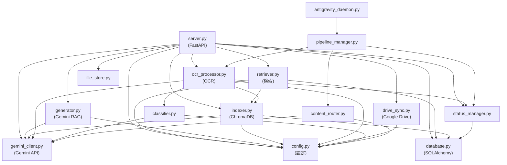

# 依存関係マップ — Architectural RAG System

> 自動生成: 2026-02-24  
> 対象: `architectural_rag/` 配下の全 `.py` ファイル (59 files)

---

## エンドポイント一覧

| メソッド | パス | 関数名 | 呼び出すモジュール | 依存する外部サービス |
|---|---|---|---|---|
| GET | `/` | `root` | — | — |
| GET | `/api/health` | `health_check` | `retriever` → `chromadb`, `database` → SQLAlchemy, `gemini_client` → Gemini | ChromaDB, SQLite, Gemini API |
| POST | `/api/chat` | `chat` | `retriever`, `generator` | ChromaDB, Gemini API |
| POST | `/api/chat/stream` | `chat_stream` | `retriever`, `generator` | ChromaDB, Gemini API |
| GET | `/api/stats` | `get_stats` | `retriever` → `database` | SQLite, ChromaDB |
| GET | `/api/ocr/status` | `get_ocr_status` | `database` | SQLite |
| DELETE | `/api/ocr/status/{path}` | `dismiss_ocr_status` | `status_manager` | SQLite |
| POST | `/api/index` | `rebuild_index` | `indexer` → `chromadb`, `gemini_client` | ChromaDB, Gemini API, ファイルシステム |
| POST | `/api/upload/multiple` | `upload_multiple_files` | `file_store`, `indexer`, `drive_sync` | SQLite, ファイルシステム, Google Drive |
| GET | `/api/files` | `list_files` | `indexer` | ファイルシステム |
| GET | `/api/files/view/{path}` | `view_file` | — | ファイルシステム |
| GET | `/api/files/tree` | `get_files_tree` | `status_manager` | SQLite, ファイルシステム |
| GET | `/api/files/{id}/info` | `get_file_info` | `file_store` | SQLite |
| DELETE | `/api/files/delete` | `delete_file` | `indexer`, `status_manager` | ChromaDB, SQLite, ファイルシステム |
| DELETE | `/api/files/bulk-delete` | `bulk_delete_files` | `indexer`, `status_manager` | ChromaDB, SQLite, ファイルシステム |
| GET | `/api/pdf/{file_id}` | `view_pdf` (L574) | — | ファイルシステム |
| GET | `/api/pdf/{file_id}` | `get_pdf` (L1127) ⚠️ **重複** | `file_store` | ファイルシステム |
| GET | `/api/pdf/list` | `list_pdfs` | `database` | SQLite |
| GET | `/api/pdf/metadata/{id}` | `get_pdf_metadata` (L610) | `database` | SQLite |
| GET | `/api/pdf/metadata/{id}` | `get_pdf_metadata` (L1187) ⚠️ **重複** | `file_store` | SQLite |
| GET | `/api/categories` | `list_categories` | — | ファイルシステム |
| GET | `/api/tags` | `get_tags` | `database`, `retriever` (via chromadb) | ChromaDB |
| GET | `/api/drive/status` | `drive_status` | `drive_sync` | Google Drive API |
| POST | `/api/drive/auth` | `drive_auth` | `drive_sync` | Google OAuth |
| GET | `/api/drive/callback` | `drive_callback` | `drive_sync` | Google OAuth |
| POST | `/api/drive/upload` | `drive_upload` | `drive_sync` | Google Drive API |
| POST | `/api/drive/sync` | `drive_sync` | `drive_sync` | Google Drive API |
| GET | `/api/drive/folders` | `drive_list_folders` | `drive_sync` | Google Drive API |
| POST | `/api/sync-drive` | `sync_to_drive` | `drive_sync` | Google Drive API, ファイルシステム |
| POST | `/api/upload` | `upload_file` (L1032) | `pipeline_manager`, `indexer`, `drive_sync` | ファイルシステム, Gemini |
| GET | `/api/system/export-source` | `export_source` | — | ファイルシステム |
| GET | `/api/settings/gemini-key` | `get_gemini_key` | — | 環境変数 |
| POST | `/api/settings/gemini-key` | `set_gemini_key` | — | 環境変数 |
| POST | `/api/settings/test-gemini` | `test_gemini_key` | `gemini_client` | Gemini API |

> ⚠️ `/api/pdf/{file_id}` と `/api/pdf/metadata/{file_id}` は `server.py` 内で **2箇所ずつ定義** されており、後方のルートが優先される可能性がある。

---

## 共有モジュール一覧（影響範囲が広い順）

| # | モジュール | 参照元ファイル数 | 主な利用者 |
|---|---|---|---|
| 1 | `config.py` | **22** | server, indexer, retriever, generator, ocr_processor, drive_sync, classifier, database, status_manager, etc. |
| 2 | `database.py` | **9** | server, indexer, retriever, status_manager, fix_db, recategorize |
| 3 | `gemini_client.py` | **6** | server, indexer, generator, ocr_processor, drawing_processor, content_router, classifier |
| 4 | `drive_sync.py` | **5** | server (6箇所で lazy import) |
| 5 | `indexer.py` | **4** | server, retriever, test_index, retry_ocr |
| 6 | `status_manager.py` | **4** | server, pipeline_manager, ocr_processor |
| 7 | `ocr_processor.py` | **3** | server, pipeline_manager, retry_ocr |
| 8 | `ocr_utils.py` | **2** | ocr_processor, content_router |
| 9 | `file_store.py` | **2** | server, recategorize_legacy_files |
| 10 | `classifier.py` | **2** | ocr_processor, recategorize_legacy_files |
| 11 | `retriever.py` | **1** | server (top-level import) |
| 12 | `generator.py` | **1** | server (top-level import) |
| 13 | `pipeline_manager.py` | **2** | server, antigravity_daemon |
| 14 | `content_router.py` | **1** | pipeline_manager |

---

## コアモジュール依存グラフ

---

## ファイル構造（コアモジュールのみ）

| ファイル | 行数 | 役割 |
|---|---|---|
| `server.py` | 1300 | FastAPI全エンドポイント（**巨大すぎ、分割推奨**） |
| `indexer.py` | 644 | ChromaDB インデックス構築 & Embedding |
| `retriever.py` | 390 | ベクトル検索 & コンテキスト構築 |
| `drive_sync.py` | 463 | Google Drive 双方向同期 |
| `ocr_processor.py` | 370 | Gemini Vision OCR パイプライン |
| `database.py` | ~200 | SQLAlchemy モデル & セッション管理 |
| `generator.py` | ~120 | Gemini RAG 回答生成 |
| `status_manager.py` | ~240 | OCR ステータス管理 |
| `config.py` | 93 | 全設定値 |
| `pipeline_manager.py` | ~90 | ファイル処理パイプライン統括 |
